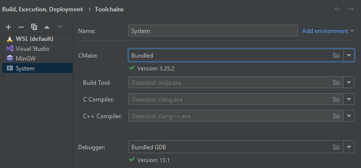
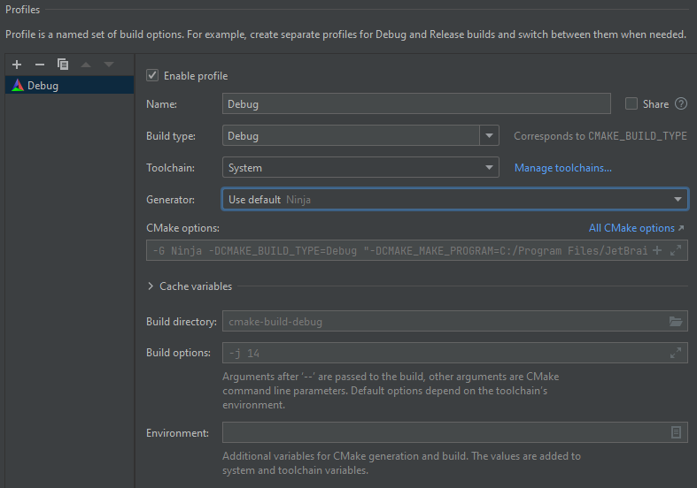

[Return](../README.md)

# Build

## CLion

- Go to `File` -> `Settings` -> `Build, Execution, Deployment` -> `Toolchains` -> `+` -> `System`

- Go to `File` -> `Settings` -> `Build, Execution, Deployment` -> `CMake` -> add a new profile with the toolchain you just created named `Debug`

- Go to `CMakeLists.txt` and reload it

## Other on Windows

Run `build.bat`