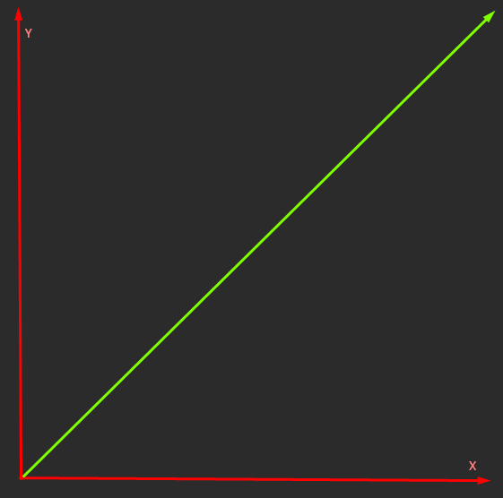
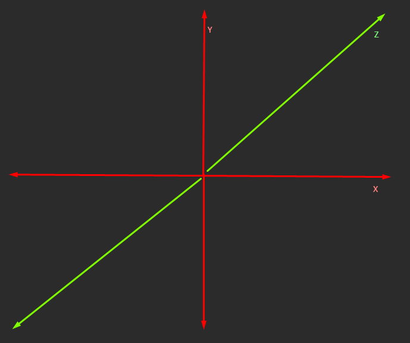

[Return](../README.md)

## How to compile the shader

Run `buildShader.bat`

## Terms signification

- Screen space: The screen space is the space of the screen. It is a 2D space with the origin in the bottom left corner of the screen.

- World space: The world space is the space of the world. It is a 3D space with the origin in the center of the world. Position (-1, -1, 0) to (1, 1, 1).

